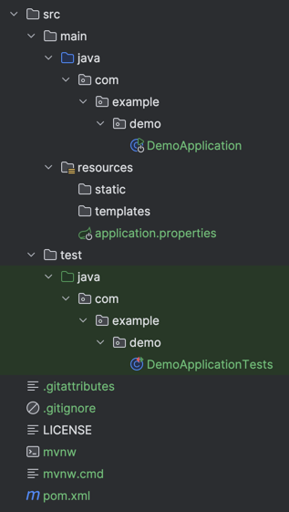
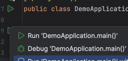

# Spring boot example project for beginners

## Introduction
This project is meant as a brief introduction into java/spring world for complete beginners that are only familiar with basics of java.
It should lead you step-by-step through the process of setting up and writing simple application with REST API and database storage.

*Following guide will be focused on MacOS and IntelliJ Idea.*

## Prerequisites
Download and install good IDE. [IntelliJ IDEA](https://www.jetbrains.com/idea/) is the best option, but does not support Spring in free version. [Visual Studio Code](https://code.visualstudio.com/) is also very good option.

Download and install latest version of Java. I recommend [Eclipse Temurin](https://adoptium.net/temurin/releases/) as it has open license and is backed by trusted organisation.

Download and install [Docker Desktop](https://www.docker.com/). This will extremely simplify the initial set up of 3rd party dependencies, as postgresql.

*Note - Docker is container engine that allows user to run various "prepackaged" applications without need to install them on local machine.
Docker (or similar technologies) is widely used in all environments and helps to mitigate large amount of environment-specific issues. It's **really** a good idea to get familiar with docker.*

## Generate project skeleton
To start with development of spring application, you should generate skeleton of the application using [Spring initializr](https://start.spring.io).

Here, simple gui can give you head start into the world of spring-based application

On the left side, there is basic project settings. On the image below is recommended settings for beginners, so it's easy to start with the implementation.


- Maven is the simplest project management tool, more declarative than gradle and easier to understand and configure.
- Spring boot version should always be set to the newest available release.
- Packaging should always be set to `Jar`
  - Application packaged with `.jar` has built-in application server, which simplifies both initial setup and application deployment.
  - `.war` packaging is intended for deployment to standalone application server, which is more difficult to set up and deploy.
- Java should be always set to the newest available LTS Java release


- Spring Boot DevTools is package that provides various QoL features during development.
- Spring Web is library for building web applications. Contains Tomcat embedded application server (allows the application to be started without external application server).
- Spring Data JDBC provides tools for communication with database
- MariaDB Driver is driver for specific database engine ([MariaDB](https://mariadb.org/), easy-to-use SQL database engine with open source license)

After you click on **GENERATE** button, the project will be generated into `.zip` file. Download and extract the `.zip` file.

## Set up GitHub access from command line
To enable GitHub access from command line, SSH key needs to be generated and assigned to GitHub account.

### Generating SSH key
Open `Terminal` application and put following commands to generate new ssh key

```shell
cd ~/.ssh
ssh-keygen -t ed25519 -f github -C "your_email@example.com" # Replace with your email
```
When asked for passphrase, confirm empty passphrase twice to create unencrypted record.

After the key is generated, run following command to copy public key of newly created key into clipboard:

```shell
cd ~/.ssh
cat github.pub | pbcopy
```

Go to [GitHub SSH keys setup](https://github.com/settings/keys), click **New SSH key** button.


Save the key and go back to terminal. Open file ~/.ssh/config using:

```shell
cd ~/.ssh
touch config
open config
```

And append following lines at the end of the file:

```text
Host github.com
  HostName github.com
  IdentityFile ~/.ssh/github
```

Save the file and close the editor.

After everything is set up, you can then check everything is working properly by executing command:

```shell
ssh git@github.com
```

If the key is set up properly, following message should be displayed:

```text
PTY allocation request failed on channel 0
Hi ihlavnicka! You've successfully authenticated, but GitHub does not provide shell access.
Connection to github.com closed.
```

## Create GitHub repository
Go to [New repository](https://github.com/new) page on GitHub.


Select name, optionally description and choose whether the repository should be public (accessible to everyone) or private (accessible only to you and whoever you invite).

Then click **Create repository** button.

In your newly created repository, click the **<> Code** button and select **Local** tab and **SSH** option below


Copy the URL (will be used in next section)

## Create new project from remote repository

1. Start IntelliJ Idea
2. On the start page, click button **Get from VCS**
3. Select directory where the new project should be created
4. Paste the SSH path copied in previous step (should always start with `git@github.com`, if it starts with `https://`, it **won't** work!)
5. Click **Clone** button. If everything is set up correctly, the project should be cloned from remote repository, without asking for credentials.
6. If the IDE asks you whether you trust the project, select **trust**
7. Copy the **whole** content from previously generated project skeleton (do not forget hidden files! If you cannot see any hidden files between the extracted files, press <kbd>&#8984;</kbd>+<kbd>&#8679;</kbd>+<kbd>.</kbd> to show hidden files)

Now you should have the project set up.

## Generated project structure

Newly generated project has the following structure:



- `src/main/java`
  - Folder, where all java packages and classes are located
  - Java classes are grouped into **packages** (explained below).
- `src/main/resources`
  - Folder with non-code resources (project properties and configurations, certificates, binary files, ...)
  - Resources are bundled into resulting .jar (or .war) package and always accessible from application.

### Java packages

Java classes are grouped into packages.

It is usually composed of 3-4 parts:
1. Domain name of author's/company's website/internal second-level domain **in reverse order**
2. Application/library name
3. Application domain/module OR resource
4. Application domain/module OR resource (optional)

Example:
- E.g. if the company's official website is located at https://www.thisisfakesite.com/
- Application is named `Fake tool`
- (domains are omitted for simplicity)
- There are **controllers**, **storage** and **config** resources

Packages are represented by folder structure.

```text
com
└── thisisfakesite
    └── faketool
        ├── config
        ├── controllers
        └── storage
```

In case some packages shares the beginning of the path, it's also shared in file system.

It's typical for programmer to adhere to some of best practices for grouping java classes into groups.

## DemoApplication.java

`DemoApplication.java` is the entry point of the application. It contains single method with exact signature to allow executing this methods in the same manner as in console application:

The method has to
- Have `public` modifier (accessible from everywhere)
- Have `static` modifier (invokable without instantiation of the class)
- Be named "main"
- Have single `String[]` argument, typically named "args"

```java
@SpringBootApplication
public class DemoApplication {

	public static void main(String[] args) {
		SpringApplication.run(DemoApplication.class, args);
	}

}
```

This ensures that the method is runnable directly from IDE.



The line `SpringApplication.run(DemoApplication.class, args);` is responsible for starting the whole application stack.

## application.properties

This file contains the main configuration of the application. This file contains key-value pairs that are configuring
all parts of the application.

In our application, first we need to configure the access to the database. We know that our mariadb instance will be running on `localhost` on port `3306`.
It will have default user `root` and with password `password`. So we can configure database access right away.

```properties
spring.datasource.url=jdbc:mariadb://localhost:3306/example?createDatabaseIfNotExist=true
spring.datasource.username=root
spring.datasource.password=password
```

## Starting the database server

Open your `Terminal` application and run command

```shell
docker run --detach --name mariadb -p 3306:3306 --env MARIADB_ROOT_PASSWORD=password mariadb:latest
```

This will start full `mariadb` instance in container, suitable for local development.

**Warning**: In this configuration, all data are located directly in container, so destruction of the container will result in data loss. If you need to avoid this,
there are multiple ways how to achieve that. Simplest way is to mount local directory into container's data directory:

```shell
mkdir -p ~/docker/mariadb/data
docker run --detach --name mariadb -p 3306:3306 -v ~/docker/mariadb/data:/var/lib/mysql:Z --env MARIADB_ROOT_PASSWORD=password mariadb:latest
```

However, during development, it can sometimes be beneficial to just delete the whole database when there is some inconsistency.

Once the container is started, you can view its state in Docker Desktop application.


## Running the application

Always select `Debug` option to run the application. **Only when the application is started in debug mode, the actual debugging of the application (using breakpoints, evaluation etc.) will be working!**

After first startup via button located in `DemoApplication.java`, you can use this controls to start/stop/restart application:


After successful application startup, the application will print log similar to this:
```text
  .   ____          _            __ _ _
 /\\ / ___'_ __ _ _(_)_ __  __ _ \ \ \ \
( ( )\___ | '_ | '_| | '_ \/ _` | \ \ \ \
 \\/  ___)| |_)| | | | | || (_| |  ) ) ) )
  '  |____| .__|_| |_|_| |_\__, | / / / /
 =========|_|==============|___/=/_/_/_/

 :: Spring Boot ::                (v3.3.4)

2024-10-19T01:36:04.133+02:00  INFO 56975 --- [demo] [  restartedMain] com.example.demo.DemoApplication         : Starting DemoApplication using Java 21.0.3 with PID 56975 (/Users/ajvo/Dev/Personal/IdeaProjects/spring-example-project/target/classes started by ajvo in /Users/ajvo/Dev/Personal/IdeaProjects/spring-example-project)
2024-10-19T01:36:04.133+02:00  INFO 56975 --- [demo] [  restartedMain] com.example.demo.DemoApplication         : No active profile set, falling back to 1 default profile: "default"
2024-10-19T01:36:04.184+02:00  INFO 56975 --- [demo] [  restartedMain] .s.d.r.c.RepositoryConfigurationDelegate : Bootstrapping Spring Data JDBC repositories in DEFAULT mode.
2024-10-19T01:36:04.185+02:00  INFO 56975 --- [demo] [  restartedMain] .s.d.r.c.RepositoryConfigurationDelegate : Finished Spring Data repository scanning in 0 ms. Found 0 JDBC repository interfaces.
2024-10-19T01:36:04.212+02:00  INFO 56975 --- [demo] [  restartedMain] o.s.b.w.embedded.tomcat.TomcatWebServer  : Tomcat initialized with port 8080 (http)
2024-10-19T01:36:04.212+02:00  INFO 56975 --- [demo] [  restartedMain] o.apache.catalina.core.StandardService   : Starting service [Tomcat]
2024-10-19T01:36:04.212+02:00  INFO 56975 --- [demo] [  restartedMain] o.apache.catalina.core.StandardEngine    : Starting Servlet engine: [Apache Tomcat/10.1.30]
2024-10-19T01:36:04.216+02:00  INFO 56975 --- [demo] [  restartedMain] o.a.c.c.C.[Tomcat].[localhost].[/]       : Initializing Spring embedded WebApplicationContext
2024-10-19T01:36:04.216+02:00  INFO 56975 --- [demo] [  restartedMain] w.s.c.ServletWebServerApplicationContext : Root WebApplicationContext: initialization completed in 82 ms
2024-10-19T01:36:04.260+02:00  INFO 56975 --- [demo] [  restartedMain] com.zaxxer.hikari.HikariDataSource       : HikariPool-2 - Starting...
2024-10-19T01:36:04.266+02:00  INFO 56975 --- [demo] [  restartedMain] com.zaxxer.hikari.pool.HikariPool        : HikariPool-2 - Added connection org.mariadb.jdbc.Connection@5baecd52
2024-10-19T01:36:04.266+02:00  INFO 56975 --- [demo] [  restartedMain] com.zaxxer.hikari.HikariDataSource       : HikariPool-2 - Start completed.
2024-10-19T01:36:04.275+02:00  WARN 56975 --- [demo] [  restartedMain] o.s.b.d.a.OptionalLiveReloadServer       : Unable to start LiveReload server
2024-10-19T01:36:04.279+02:00  INFO 56975 --- [demo] [  restartedMain] o.s.b.w.embedded.tomcat.TomcatWebServer  : Tomcat started on port 8080 (http) with context path '/'
2024-10-19T01:36:04.281+02:00  INFO 56975 --- [demo] [  restartedMain] com.example.demo.DemoApplication         : Started DemoApplication in 0.158 seconds (process running for 11.826)
2024-10-19T01:36:04.281+02:00  INFO 56975 --- [demo] [  restartedMain] .ConditionEvaluationDeltaLoggingListener : Condition evaluation unchanged
```

Now you can access http://localhost:8080 from your browser. It should return 404, as there is no resource on root path:

```text
Whitelabel Error Page

This application has no explicit mapping for /error, so you are seeing this as a fallback.
Sat Oct 19 01:49:38 CEST 2024
There was an unexpected error (type=Not Found, status=404).
No static resource .
org.springframework.web.servlet.resource.NoResourceFoundException: No static resource .
```

Now the application has successfully started and is connected to the database.